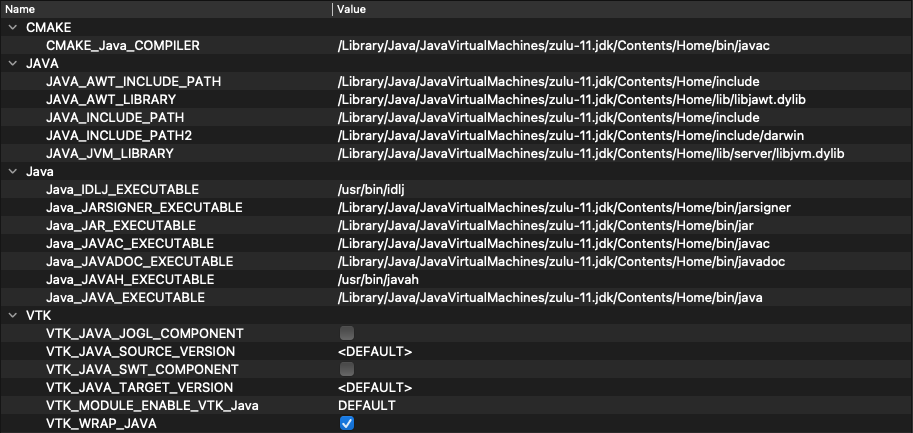

vtk-java-wrapper
================

Shows how to work with VTK Java Wrappers.

# Download VTK libraries

Build it by following the instruction below, or download it [here](https://download.jzy3d.org/vtk/build/).

WARNING : Pre-built VTK library files are made for a target JDK


# Running an example

## Reading a VTU file

Run ReadVTU.java with
* -Djava.library.path=./lib/{platform} (preferred)
* -Djava.library.path=/opt/homebrew/Cellar/vtk/9.0.3/lib
* -Djava.library.path=/Users/martin/Dev/jzy3d/private/vtk-java-wrapper/lib/vtk-Darwin-x86_64
* lib/{platform}/ as runtime directory  

NB : wrappers with Python and Java in their name fail to load. I renamed the dylib so that they end by _POUET to minimize errors in console, but it is still normal to see

```
vtkPythonContext2DJava not loaded
vtkFiltersPythonJava not loaded
vtkCommonPythonJava not loaded
```

Appart of this, an ```Exception in thread "main" java.lang.UnsatisfiedLinkError``` may mean that you forgot to set your current directory to where the native libraries stand.

## Displaying a VTK Window

Run SimpleVTK.java. Crashing on my mac os with JOGL.

https://vtk.org/Wiki/VTK/Java_Wrapping


# Building VTK for Java

Following instruction are copied from this [page](https://www.particleincell.com/2011/vtk-java-visualization/) which is provided by the official [VTK instructions page](https://vtk.org/Wiki/VTK/Java_Wrapping)

## VTK JAVA Wrappers

So how do you couple VTK with Java? It’s very easy. VTK comes with support for Java in the form of Java wrappers. In the following sections we show you how to install and configure the VTK / Java development environment and how to use it to build a simple Java GUI-driven application.

We are assuming you already have JDK and a Java development environment such as Netbeans or Eclipse installed. In addition you will need to download the VTK source and build it. This requires a working C++ compiler. On Windows, you can obtain the Microsoft Visual Studio Express Edition for free. Then follow these steps to get started:

* Download CMake from cmake.org. CMake is a cross-platform configuration tool for VTK. It will query your system for the available compilers and settings, and will generate the appropriate project files needed to build VTK.
* Download VTK source from vtk.org. Make sure to download the Source package and not the Windows Installer.
* Unzip the source to some temporary directory.
* Configure your project files by running CMake. Specify the location to the source files you just unzipped and also a different directory where to build the files. This build folder is used during the compilation stage, however at the end, files will be installed into the appropriate system folders. Click Configure to start the process. CMake will run for a while performing various system tests. It will finish with another screen with additional options highlighted in red.
* Enable Java Wrapping by selecting the appropriate check box (see Figure 1). You will also need to enable the shared libraries. I generally uncheck build tests / examples to reduce the compilation time. Press Configure again. If everything went well, you will see the Generate button become available. Press this button to generate the project files.
cmake customization screen
* Compile VTK by launching the solution file located in the build folder. If you are using Visual Studio on Microsoft Windows, right click on ALL_BUILD and then select Build. The compiler with churn for a while. Depending on your machine, this may take multiple hours. If you are using make, use the appropriate make command (most likely make all but this was not tested).
* Install the system libraries, assuming no errors were encountered, by right clicking on INSTALL and selecting Build. Make sure you run Visual Studio as an administrator for this step. If you do encounter linker errors in the Java wrappers, make sure you are linking against the correct version of Java. My machine is running a 64-bit version of Windows 7. However, I only have the 32-bit C++ compilers. My default Java JDK is the 64-bit version, which resulted in an unresolved symbol “__imp__JAWT_GetAWT@8” linker error in vtkRenderingJava. If you do encounter these types of errors, make sure to download the 32-bit version of Java JDK and link against it by adjusting the input path under Linker->Input property page for the appropriate project.
* Check your PATH. The final piece, and likely the biggest headache, is making sure that your Java program can find the required VTK DLLs. These may in turn depend on other DLLs that may not be in the path. Great tool for checking DLL dependencies is Dependency Walker. It took me a while to get everything set up, and in the end, the following directories did the trick. Of course, your setup will likely differ.
* C:WindowsSystem32;C:Program Files (x86)VTKbin;C:Program Files (x86)Javajdk1.6.0_30lib;C:Program Files (x86)Javajre6bin;C:Program Files (x86)Javajre6binclient;C:Program Files (x86)Microsoft Visual Studio 9.0VCredistx86Microsoft.VC90.CRT;
* Copy vtk.jar to somewhere safe. This file is located in the bin directory in your VTK build folder. It is better to move it out of here in case you later decide to delete the build directory. It is over 1Gb after all and you don’t need it post Install unless you actually plan to modify the VTK libraries themselves.

## Additional notes

Here are my settings for building 9.1.0 on MacOS BigSur with an ARM64 CPU, assuming the JDK was built for ARM64 as well



Which should avoid error "Undefined symbols for architecture arm64: "_JAWT_GetAWT"".

One may also edit the CMakeCache.Txt to disable AWT link

```
//ADVANCED property for variable: JAVA_AWT_INCLUDE_PATH
JAVA_AWT_INCLUDE_PATH-ADVANCED:INTERNAL=0
//ADVANCED property for variable: JAVA_AWT_LIBRARY
JAVA_AWT_LIBRARY-ADVANCED:INTERNAL=0
```

You may have to finalize the jar manually

```
cd Wrapping/Java/CMakeFiles/vtkjava.dir/
jar --create -f ../../../../lib/java/vtk-9.1.0.jar vtk
```

Then copy
* `{VTK-BUILD-DIR}/lib/java/vtk.jar` to `./lib/vtk-{version}.jar`
* `{VTK-BUILD-DIR}/lib/java/{platform}.jnilib` to `./lib/{version}/{platform}`
* `{VTK-BUILD-DIR}/lib/{platform}.jnilib` to `./lib/{version}/{platform}`

## Troubleshooting

```
java.lang.UnsatisfiedLinkError: /Users/martin/Dev/jzy3d/private/vtk-java-wrapper/lib/9.1.0/vtk-Darwin-arm64/libvtkCommonCoreJava.jnilib: dlopen(/Users/martin/Dev/jzy3d/private/vtk-java-wrapper/lib/9.1.0/vtk-Darwin-arm64/libvtkCommonCoreJava.jnilib, 1): no suitable image found.  Did find:
	/Users/martin/Dev/jzy3d/private/vtk-java-wrapper/lib/9.1.0/vtk-Darwin-arm64/libvtkCommonCoreJava.jnilib: mach-o, but wrong architecture
```

Ensure you have a ARM64 JVM


## Usefull flags

Extra CMake options for specifying source & target versions
```
-DVTK_JAVA_SOURCE_VERSION=1.8
-DVTK_JAVA_TARGET_VERSION=1.8
```

## See also

https://github.com/Kitware/VTK/tree/master/Wrapping/Java

# Documentation

* [VTK Guide (online)](https://kitware.github.io/vtk-examples/site/VTKBook/00Preface/)
* [VTK Guide PDF](./doc/VTKTextBook.pdf)
* [VTK 9.1.0 release note](https://gitlab.kitware.com/vtk/vtk/-/blob/master/Documentation/release/9.1.md)
