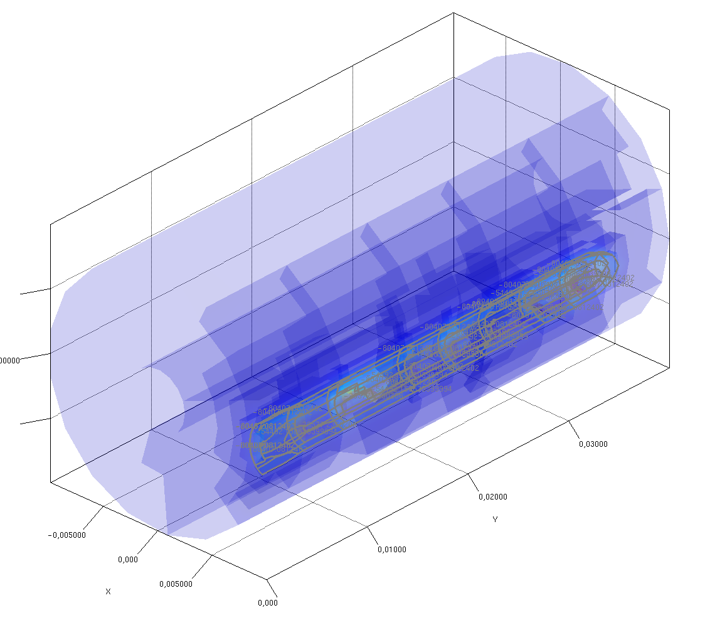
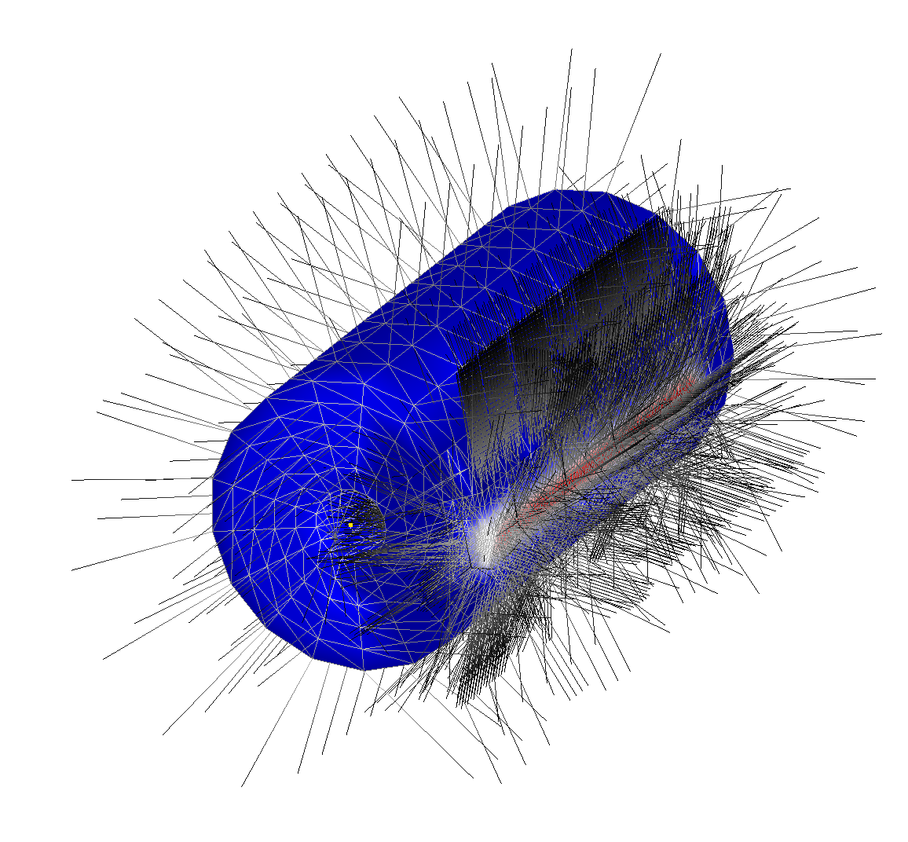
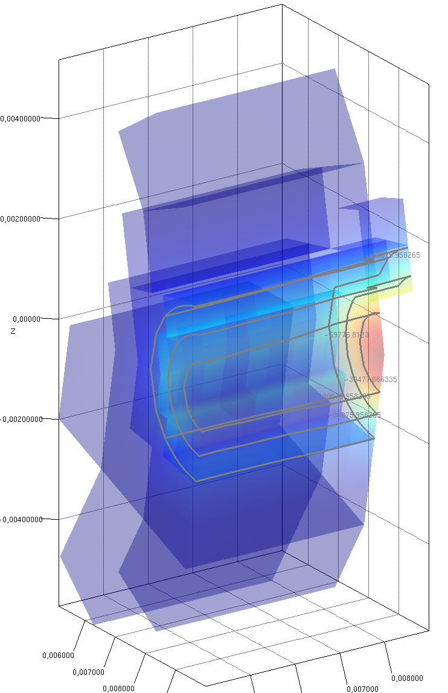

# Problem

When loading a PVTU, hence a collection of VTU blocks, I can not process the piece contour as a single element. 


When trying vtkGeometryFilter, duplicate points are removed, but some internal faces can't be filtered, so contour seams to be applied separately on each sub block. vtkContour is wrapped in VTKContourProcessor.



I am surprised that some internal face remains in the vtkUnstructuredGrid after applying vtkGeometryFilter. These internal faces are visible by stronger blue color.

Another way of seing the internal face effect on algorithms is by displaying normals (reproduce by uncommenting ```chart.add(builderVBO.makeNormalsAsLines(100))``` )



Duplicate points - if any is remaining - are highlighted with red dots.


# Expected result

When applying contour to a single block, contour appear correctly

### Enthalpy_HS_cylinder_080_0.vtu



### Questions

I am looking for a way to process contour globally and not per VTU. If PVTU were correctly working, I should only see 5 contour lines. Instead I got 46, which is approximately 5 for each of the 10 VTU. See the console output indicating

```
contour.n=5
contour.min=-106322.00385
contour.max=-2662.3134108
contour.lines=46
```

I wonder if I should use vtkContour3DLinearGrid (which is wrapped in VTKContourGridProcessor in PVTU.java) but I did not succeed to make it work.


# Reproduce

I use VTK 9.0.3 and 9.1.0-rc2 and am packaging native libs built with/for my MacOS 10.12.3 and MacOS 11.4 for ARM64.
You may have to run the below programs with your own native if not running on MacOS.

Build and test project with :

```
mvn install
```

Run global PVTU contour processing with PVTU.java with VM args as mentionned in javadoc.

Run global single VTU contour processing with PVTU_Part.java with VM args as mentionned in javadoc.

